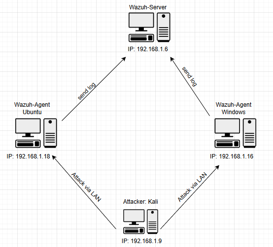
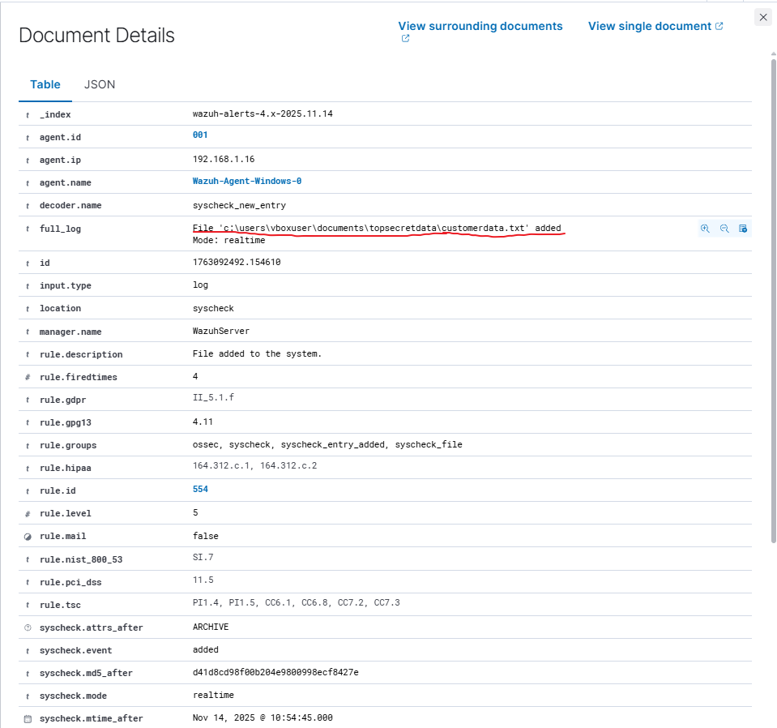

# #Lab 1: Wazuh 4.14.0

[](https://www.notion.so)

# I. Thông tin LAB

**Mục tiêu chính:** Cài đặt và thử nghiệm những tính năng của Wazuh 4.14.0 như Active Response, FIM (File Integrity Monitoring), Virus Total API.

**Công cụ sử dụng:** Wazuh Manager, Wazuh Agent (Ubuntu & Windows), Kali Linux, Oracle VirtualBox, PuTTY, Remote Desktop Connection.

**Thực hiện bởi:** Nguyễn Tiến Thanh Hải

# II. Sơ đồ tổng quát



### 1. Chi tiết Host.

- Wazuh server:
    - **Vai trò:** Manager / Indexer / Dashboard
    - **HĐH:** Ubuntu Server 24.04.3
    - **IP:** `192.168.1.6`
    - **Ghi chú:** Thiết lập IP tĩnh và là trung tâm thu thập log và phân tích.
- Wazuh Agent Ubuntu:
    - **Vai trò:** Agent và Target Endpoint 1
    - **HĐH:** Ubuntu Desktop 24.04.2
    - **IP:** `192.168.1.18`
    - **Ghi chú:** Cài và start **OpenSSH Server** để kiểm tra Brute Force SSH.
- Wazuh Agent Windows:
    - **Vai trò:** Agent và Target Endpoint 2
    - **HĐH:** Windows Server 2022
    - IP: `192.168.1.16`
    - **Ghi chú:** Bật **RDP** để kiểm tra Brute Force RDP.
- Attacker Kali:
    - **Vai trò:** Attacker
    - **HĐH:** Kali linux
    - **IP:** `192.168.1.9`
    - **Ghi chú:** Phải đảm bảo rằng máy attacker có thể ping được đến 2 máy target.

### 2. Cấu hình Mạng

- Tất cả các máy trong sơ đồ đều cài mode Bridged Adapter hoặc NAT miễn là trong cùng 1 mạng LAN và có thể ping được đến nhau.


# **III. Cấu hình Wazuh server**

### 1. Cài đặt Wazuh server

- **Bước 1:** Set IP tĩnh cho server
    
    
    

Truy cập path:

```jsx
sudo nano /etc/netplan/50-cloud-init.yaml
```

Cấu hình như sau:

     Sau khi cấu hình xong thì apply cấu hình bằng lệnh:

```jsx
sudo netplan apply
```

- **Bước 2:** Cài đặt Wazuh server thông qua script quickstart

```jsx
curl -sO [https://packages.wazuh.com/4.14/wazuh-install.sh](https://packages.wazuh.com/4.14/wazuh-install.sh) && sudo bash ./wazuh-install.sh -a
```

**Lưu ý:** Script có thể thay đổi tùy vào từng phiên bản hãy sử dụng script quickstart ở web chính thức của Wazuh


- **Bước 3:** Sử dụng “User” và “Password” vừa được cấp đăng nhập vào dashboard

Truy cập dashboard bằng:

```jsx
https://"your ip address"
```

Giao diện đăng nhập của wazuh dashboard:


Giao diện wazuh dashboard:


### 2. Đổi mật khẩu cho account admin

- **Bước 1:** Truy cập path
    
    ```jsx
     cd /usr/share/wazuh-indexer/plugins/opensearch-security/tools/
    ```
    
- **Bước 2:** Dùng script để thay password

```jsx
/usr/share/wazuh-indexer/plugins/opensearch-security/tools# ./wazuh-passwords-tool.sh -u admin -p "your new pass word"
```

Mật khẩu mới ở đây sẽ là “your new pass word” truy cập lại dashboard với mật khẩu mới

# IV. Cài đặt Wazuh Agent

### 1. Cài Wazuh Agent trên Windows

- **Bước 1:** Cấu hình Agent trên dashboard
    - Chọn setting (dấu 3 gạch) → Chọn Agent management → Summary → Ấn Deploy new agent


- **Bước 2:** Cấu hình nội dung cho Agent
    - Select Pakages: Chọn Windows
    - Server Address: Nhập IP của Wazuh server
    - Optional Settings: Tùy chọn
    - Run Command: Sao chép đoạn power shell đã được generated ở bên dưới và dán vào power shell của Wazuh-Agent Windows-0 với quyền admin rồi chạy (Lưu ý: đoạn power shell bên dưới chỉ mang tính tượng trưng !!!)
    
    ```jsx
    Invoke-WebRequest -Uri [https://packages.wazuh.com/4.x/windows/wazuh-agent-4.14.1-1.msi](https://packages.wazuh.com/4.x/windows/wazuh-agent-4.14.1-1.msi) -OutFile $env:tmp\wazuh-agent; msiexec.exe /i $env:tmp\wazuh-agent /q WAZUH_MANAGER='192.168.1.6' WAZUH_AGENT_NAME='Wazuh-Agent-Windows-0' 
    ```
    
    - Start Service: NET START Wazuh


Sau khi chạy xong vào wazuh dashboard kiểm tra xem agent đã active chưa:


### 2. Cài Wazuh-Agent trên Linux

- **Bước 1:** Cấu hình Agent trên dashboard
    - Chọn setting (dấu 3 gạch) → Chọn Agent management → Summary → Ấn Deploy new agent


- **Bước 2:** Cấu hình nội dung cho Agent
    - Select Pakages: Chọn Linux (Chọn kiến trúc tùy vào loại Linux)
    - Server Address: Nhập IP của Wazuh server
    - Optional Settings: Tùy chọn
    - Run Command: Sao chép đoạn command đã được generated ở bên dưới và dán vào terminal của Wazuh-Agent-Ubuntu-0 với quyền root rồi chạy (Lưu ý: đoạn command bên dưới chỉ mang tính tượng trưng !!!)
    
    ```jsx
    wget [https://packages.wazuh.com/4.x/apt/pool/main/w/wazuh-agent/wazuh-agent_4.14.1-1_amd64.deb](https://packages.wazuh.com/4.x/apt/pool/main/w/wazuh-agent/wazuh-agent_4.14.1-1_amd64.deb) && sudo WAZUH_MANAGER='192.168.1.6' WAZUH_AGENT_NAME='Wazuh-Agent-Ubuntu-0' dpkg -i ./wazuh-agent_4.14.1-1_amd64.deb
    ```
    
    - Start Service:
    
    ```jsx
    sudo systemctl daemon-reload
    sudo systemctl enable wazuh-agent
    sudo systemctl start wazuh-agent
    ```
    


Sau khi chạy xong vào wazuh dashboard kiểm tra xem agent đã active chưa:


# V. Cấu hình tính năng FIM trên Wazuh

- **Định nghĩa:** FIM (File Integrity Monitoring), hay giám sát tính toàn vẹn tệp, là một quá trình bảo mật nhằm mục đích xác minh xem các tệp hệ thống, tệp cấu hình và các tệp ứng dụng quan trọng có bị thay đổi một cách trái phép hay không.

### 1. Cấu hình FIM cho windows

- **Bước 1:** Tìm và mở file cấu hình trên Windows Agent
    - Truy cập path:
    
    ```jsx
    C:\Program Files (x86)\ossec-agent
    ```
    
    - Ấn vào file exe win32ui vào tab View chọn View Config
    
    
    
    - Ở file ossec.conf tìm file integrity
    
    
    
- **Bước 2:** Cấu hình giám sát file, thư mục chỉ định trên Windows Agent
    - Copy đường dẫn thư mục hoặc file muốn giám sát
    
    
    
    - Vào thư mục ossec.conf phần file integrity và thêm đoạn config sau:
    
    ```jsx
    <directories check_all="yes" report_changes="yes" realtime="yes">"your directory path"</directories>
    ```
    
    
    
    - Save và restart Agent
- **Bước 3:** Quan sát thư mục được giám sát khi có tác động lên thư mục
    - Tạo file text mới và xem log
    
    
    
    - Truy cập File Integrity Monitoring trên dashboard ấn Explore agent chọn Wazuh-Agent-Windows-0 vào mục Event và quan sát log
    
    
    
    - Xem detail log
    
    
    
    - Chỉnh sửa file trong folder
    
    
    
    - Xem detail log
    
    
    

→ Có thể thấy mọi hoạt động thêm, xóa, sửa đều được ghi log lại và monitor lên Wazuh server

### 2. Cấu hình FIM cho linux

- **Bước 1:** Mở file ossec.conf
    - Mở và chỉnh sửa file ossec.conf bằng trình soạn thảo nano:
    
    ```jsx
    sudo nano /var/ossec/etc/ossec.conf
    ```
    
    - Tìm mục file integrity monitoring
    
    
    
- **Bước 2:** Cấu hình giám sát file, thư mục chỉ định trên Windows Agent
    - Copy đường dẫn thư mục hoặc file muốn giám sát
    
    
    
    - Vào thư mục ossec.conf phần file integrity và thêm đoạn config sau:
    
    ```jsx
    <directories check_all="yes" report_changes="yes" realtime="yes">"your directory path"</directories>
    ```
    
    
    
    - Save và restart Agent
    
    ```jsx
    sudo systemctl daemon-reload
    sudo systemctl restart wazuh-agent
    ```
    
- **Bước 3:** Quan sát thư mục được giám sát khi có tác động lên thư mục
    - Tạo file text mới và xem log
    
    
    
    - Truy cập File Integrity Monitoring trên dashboard ấn Explore agent chọn Wazuh-Agent-Ubuntu-0 vào mục Event và quan sát log
    
    
    
    - Xem detail log
    
    
    
    - Chỉnh sửa file trong folder:
    
    ```jsx
    sudo nano /home/thanhhai/Documents/TopSecretData/CustomerData.txt
    ```
    
    
    
    - Xem detail log
    
    
    

→ Có thể thấy mọi hoạt động thêm, xóa, sửa đều được ghi log lại và monitor lên Wazuh server

# VI. Cấu hình các giao thức remote RDP và SSH

### **1. Cấu hình RDP trên windows**

- Chuột phải vào THIS PC
- Chọn Advanced system settings
- Chọn mục Remote và chọn Allow
- Kiểm tra kết nối RDP vào máy Wazuh-Agent Windows-0 (Bằng Remote Desktop Connection)

### 2. Cấu hình SSH trên ubuntu

- Cài đặt:

```jsx
sudo apt install openssh-server
sudo systemctl start ssh
sudo systemctl enable ssh
```

- Kiểm tra:

```jsx
sudo systemctl status ssh
```


# VII. Mô Phỏng tấn công và quan sát log

### 1. Tấn công BruteForce vào RDP trên windows agent

- Lệnh hydra trên máy kali để thực hiện tấn công

```jsx
hydra -l admin -P /usr/share/wordlists/rockyou.txt -u -s 3389 "your IP address" rdp
```


- Kiểm tra trên Dashboard của Wazuh server
    - Truy cập Thread Hunting
    - Chọn Explore agent là Wazuh-Agent-Windows-0
    - Chọn vào phần Event để quan sát log


Ấn vào log có rule.id là 60204 để xem detail log


→ Quan sát thấy rõ được source IP, loại máy và loại tấn công dựa vào cách đối chiếu với MITRE ATT&CK

### 2. Tấn công BruteForce vào SSH trên ubuntu agent

- Lệnh hydra trên máy kali để thực hiện tấn công

```jsx
hydra -l "username" -P /usr/share/wordlists/rockyou.txt "your IP address" ssh -V
```


- Kiểm tra trên Dashboard của Wazuh server
    - Truy cập Thread Hunting
    - Chọn Explore agent là Wazuh-Agent-Ubuntu-0
    - Vào phần Event để quan sát log


Ấn vào log có rule.id là 2502 để xem detail log


→ Quan sát thấy được source IP và loại tấn công dựa vào cách đối chiếu với MITRE ATT&CK

# VIII. Cấu hình Active Response ngăn chặn tấn công BruteForce

- **Định nghĩa:** Active Response hay còn gọi là Ứng phó chủ động của Wazuh là một tính năng tự động cho phép Wazuh thực hiện các hành động can thiệp ngay lập tức trên các Agent (Endpoint) hoặc các thiết bị mạng khác khi một cảnh báo bảo mật được kích hoạt.

### 1. Cấu hình Active Response

**Bước 1:** Cấu hình ossec.conf trên Wazuh server

- Dùng DashBoard của Wazuh server để thực hiện:
    - Vào Setting (Dấu 3 gạch)
    - Chọn Server Management
    - Chọn mục Settings
    - Chọn Edit Configuration

**Bước 2:** 

- Kiểm tra nội dung command

```jsx
<command>
	<name>firewall-drop</name>
	<executable>firewall-drop</executable>
	<timeout_allowed>yes</timeout_allowed>
</command>
```

- Thêm <active-response>

```jsx
<active-response>
  <disabled>no</disabled>
  <command>firewall-drop</command>
  <location>local</location>
  <rules_id>2502</rules_id>
  <timeout>180</timeout>
</active-response>
```


- Save và Restart Manager

### 2. Quan sát log khi match rule


- Có thể thấy khi rule.id 2502 match thì ngay lập tức rule.id 651 firewall-drop được kích hoạt
- **Kết quả:** máy kali tạm thời trong 180s không thể tấn công hay ping tới máy ubuntu được nữa vì đã bị firewall của ubuntu drop


- block list của Wazuh-Agent-Ubuntu-0


### 3. Config block vĩnh viễn IP máy BruteForce

- Tùy chỉnh ossec.conf trên Wazuh server
- Mục command chỉnh sửa lại thành:

```jsx
<command>
    <name>firewall-drop</name>
    <executable>firewall-drop</executable>
    <timeout_allowed>no</timeout_allowed>
  </command>
```

- Mục <active respond> chỉnh sửa lại thành time out vô thời hạn:

```jsx
<active-response>
    <disabled>no</disabled>
    <command>firewall-drop</command>
    <location>local</location>
    <rules_id>2502</rules_id>
    <!--<timeout>180</timeout>-->
  </active-response>
```

- Save và Restart Manager

# IX. Tích hợp API Virus Total để kiểm tra các file mà end point tải về

- **Định nghĩa:** **VirusTotal API** là giải pháp mở rộng khả năng nhận diện mã độc trên Wazuh thông qua việc kết nối với nền tảng **Threat Intelligence** của VirusTotal. Tính năng này cho phép tự động hóa quá trình kiểm định mức độ an toàn của tệp tin bằng cách đối chiếu mã định danh (**hash**) với cơ sở dữ liệu nhận dạng mã độc đa nguồn trên quy mô toàn cầu.

### 1. Cấu hình sử dụng API Virus Total

- **Bước 1:** Truy cập trang web VirusTotal đăng kí tài khoản

```jsx
https://www.virustotal.com/gui/home/upload
```

- **Bước 2:** Lấy API key


Copy API key


- **Bước 3:** Thêm đoạn cấu hình sau vào file ossec.conf sau đó Save và Restart server

```jsx
<integration>
	<name>virustotal</name>
	<api_key>"ur API key"</api_key>
	<group>syscheck</group>
	<alert_format>json</alert_format>
</integration>
```

**Lưu ý:** Sau khi tích hợp module **VirusTotal**, hệ thống sẽ tự động thực hiện quy trình rà quét mã độc đối với tất cả các tệp tin thuộc danh mục giám sát của module **File Integrity Monitoring (FIM)**. Bất kỳ sự thay đổi hoặc tạo mới tệp tin nào trong các thư mục đã được quản trị viên thiết lập cấu hình FIM đều sẽ trở thành đối tượng truy vấn của VirusTotal API.

### 2. Kiểm thử chức năng trên End Point Windows

- **Bước 1:** Cấu hình giám sát FIM cho thư mục Downloads ở trong file ossec.conf sau đó Save và Restart agent


- **Bước 2:** Tải thử một phần mềm độc hại vào mục Downloads


Tải xuống file .zip


- **Bước 3:** Quan sát log ở Wazuh manager


Detail log


Click vào link ở phần **data.virustotal.permalink** để xem thông tin chi tiết của file độc hại này ở trên Virus Total Web


### 3. Kiểm thử chức năng trên End Point Ubuntu

- **Bước 1:** Cấu hình giám sát FIM cho thư mục Downloads ở trong file ossec.conf sau đó Save và Restart agent


- **Bước 2:** Tải thử một phần mềm độc hại vào mục Downloads


- **Bước 3:** Quan sát log ở Wazuh manager


# X. Kết thúc lab

### 1. Lưu Ý Về Phạm Vi và Tuân Thủ Pháp Luật

- Toàn bộ các hoạt động, kịch bản tấn công, và thử nghiệm bảo mật được mô tả trong báo cáo này **chỉ được thực hiện trong môi trường phòng thí nghiệm ảo (Virtual Lab Environment)**, được kiểm soát chặt chẽ.
- **NGHIÊM CẤM** mọi hành vi tái tạo, thực thi các kịch bản tấn công này, hoặc bất kỳ hình thức xâm nhập trái phép nào khác, trong môi trường thực tế hoặc mạng lưới không được cấp quyền.
- **Hành vi tấn công, xâm nhập, hoặc dò quét trái phép vào hệ thống thực tế là hành vi vi phạm pháp luật và có thể bị truy cứu trách nhiệm hình sự theo quy định hiện hành.** Mục đích duy nhất của lab này là nhằm phục vụ cho mục đích học tập, nghiên cứu và nâng cao kỹ năng phòng thủ (Blue Team).