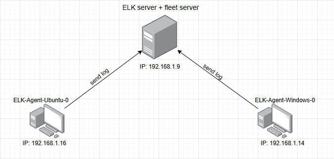
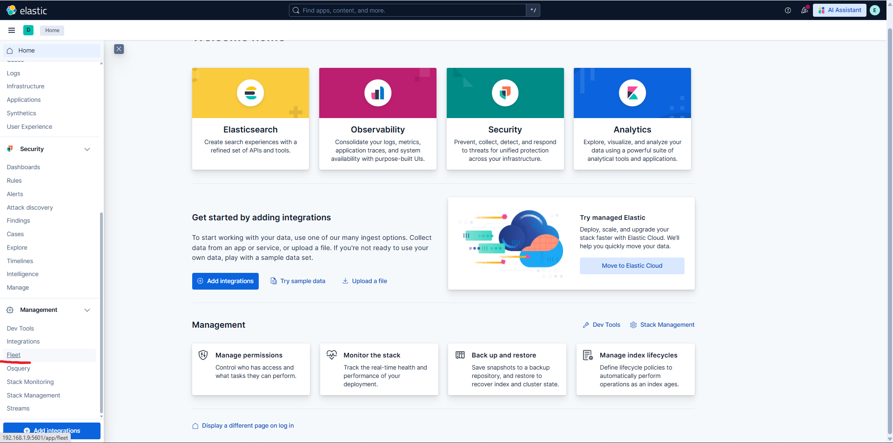

# #Lab 2: ELK stack new architecture

# I. Thông tin LAB

**Mục tiêu chính:** Triển khai kiến trúc ****Elastic Stack hiện đại (Elasticsearch-Kibana-Fleet) và sử dụng Elastic Agent để quản lý tập trung, thu thập và trực quan hóa dữ liệu log/metrics từ Endpoint.

**Công cụ sử dụng:** Ubuntu server, Ubuntu desktop, Windows, Elasticsearch (9.2.1), Kibana (9.2.1), Fleet Server, Elastic Agent, Oracle VirtualBox, PuTTY.

**Thực hiện bởi:** Nguyễn Tiến Thanh Hải

# II. Sơ đồ tổng quát



### 1. Chi tiết Host.

- ELK + Fleet Server:
    - **Vai trò:** Elasticsearch, Kibana, Fleet Server
    - **HĐH:** Ubuntu Server 24.04.3
    - **IP:** `192.168.1.9`
- ELK-Agent-Ubuntu-0:
    - **Vai trò:** Agent và Target Endpoint 1
    - **HĐH:** Ubuntu Desktop 24.04.2
    - **IP:** `192.168.1.13`
- ELK-Agent-Windows-0:
    - **Vai trò:** Agent và Target Endpoint 2
    - **HĐH:** Windows 10
    - IP: `192.168.1.14`

### 2. Cấu hình Mạng

- Tất cả các máy trong sơ đồ đều cài mode Bridged Adapter hoặc NAT miễn là trong cùng 1 mạng LAN và có thể ping được đến nhau.


# III. Cấu hình ELK server

### 1. Cấu hình IP tĩnh cho server

- Truy cập path:

```jsx
sudo nano /etc/netplan/50-cloud-init.yaml
```

Cấu hình như sau:


Sau khi cấu hình xong thì apply cấu hình bằng lệnh:

```jsx
sudo netplan apply
```

### 2. Cài đặt và cấu hình Elasticsearch thông qua APT

- **Bước 1:** Thêm Khóa PGP
    - **Mục đích:** Đảm bảo tính toàn vẹn (Integrity) và tính xác thực (Authenticity) của các gói phần mềm. APT sử dụng khóa PGP này để xác minh chữ ký số của gói Elasticsearch, đảm bảo chúng không bị can thiệp trên đường truyền.
    - Chạy đoạn script này dưới quyền root:
        
        ```jsx
        wget -qO - [https://artifacts.elastic.co/GPG-KEY-elasticsearch](https://artifacts.elastic.co/GPG-KEY-elasticsearch) | sudo gpg --dearmor -o
        /usr/share/keyrings/elasticsearch-keyring.gpg
        ```
        
- **Bước 2:** Cài đặt hỗ trợ HTTPS
    - **Mục đích:** Cài đặt gói cần thiết để APT có thể giao tiếp và tải các gói phần mềm một cách an toàn thông qua giao thức HTTPS từ các kho lưu trữ từ xa.
    - Chạy đoạn script này dưới quyền root:
    
    ```jsx
    sudo apt-get install apt-transport-https
    ```
    
- **Bước 3:** Thêm repo của Elastic 9.x
    - **Mục đích:** Thông báo cho hệ thống APT biết **địa chỉ** URL của kho lưu trữ Elastic phiên bản 9.x và cách xác thực kho lưu trữ đó sử dụng khóa GPG đã thêm ở bước 1.
    - Chạy đoạn script này dưới quyền root:
    
    ```jsx
    echo "deb [signed-by=/usr/share/keyrings/elasticsearch-keyring.gpg] [https://artifacts.elastic.co/packages/9.x/apt](https://artifacts.elastic.co/packages/9.x/apt) stable main" | sudo tee /etc/apt/sources.list.d/elastic-9.x.list
    
    ```
    
- **Bước 4:** Cài đặt Elasticsearch
    - Chạy đoạn script này dưới quyền root:
    
    ```jsx
    sudo apt-get update && sudo apt-get install elasticsearch
    ```
    
    - Sau khi quá trình hoàn tất sẽ tạo ra “password” cho elastic.
    
    
    
    **Lưu ý:** Lưu password này vào notepad để ghi nhớ và sử dụng.
    
- **Bước 5:** Cấu hình elasticsearch.yml
    - Truy cập path:
    
    ```jsx
    sudo nano /etc/elasticsearch/elasticsearch.yml
    ```
    
    - Và cấu hình như sau:
    
    ```jsx
    network.host: 0.0.0.0
    ```
    
    
    
    ```jsx
    transport.host: 0.0.0.0
    ```
    
    
    
    - **Mục đích:** Việc này chuyển Elasticsearch từ chế độ chỉ chạy cục bộ (localhost) sang chế độ truy cập mạng (network accessible), điều cần thiết cho một môi trường Lab SIEM.
- **Bước 6:** Khởi động lại dịch vụ Elasticsearch
    - Chạy lần lượt các script sau:
    
    ```jsx
    cd ~
    sudo /bin/systemctl daemon-reload
    sudo systemctl restart elasticsearch.service
    sudo /bin/systemctl enable elasticsearch.service
    sudo systemctl status elasticsearch.service
    ```
    
    
    
    - Kiểm tra dịch vụ Elasticsearch:
    
    ```jsx
    curl —cacert /etc/elasticsearch/certs/http_ca.crt -u elastic:"password của elasticsearch" https://localhost:9200
    ```
    
    
    
    → Nếu hiện thông tin như trên thì dịch vụ elasticsearch đang hoạt động.
    

### 3. Cài đặt và cấu hình Kibana thông qua APT

- **Bước 1:** Cài đặt Kibana 9.x qua APT
    - Chạy đoạn script này dưới quyền root:
    
    ```jsx
    sudo apt-get update && sudo apt-get install kibana
    ```
    
- **Bước 2:** Cấu hình kibana.yml
    - Truy cập path:
    
    ```jsx
    sudo nano /etc/kibana/kibana.yml
    ```
    
    - Và cấu hình như sau:
    
    ```jsx
    server.host: 0.0.0.0
    ```
    
    
    
- Bước 3: Khởi động lại dịch vụ Kibana
    - Chạy lần lượt các script sau:
    
    ```jsx
    sudo /bin/systemctl daemon-reload
    sudo /bin/systemctl enable kibana.service
    sudo systemctl restart kibana.service
    ```
    
    
    
- **Bước 4:** Enroll vào Elasticsearch
    - Truy cập vào dashboard:
    
    ```jsx
    http://"your ip address":5601
    ```
    
    
    
    - Tạo mã token từ script của elastic:
    
    ```jsx
    cd /usr/share/elasticsearch/bin
    ./elasticsearch-create-enrollment-token -s kibana
    ```
    
    
    
    - Lấy đoạn token này và dán vào dashboard
    
    
    
    - Tạo mã xác thực từ script của kibana:
    
    ```jsx
    cd /usr/share/kibana/bin
    ./kibana-verification-code
    ```
    
    
    
    - Nhập code này vào dashboard để xác thực:
    
    
    
- **Bước 5:** Đăng nhập vào dashboard
    - Đăng nhập bằng:
    
    ```jsx
    Username: elastic
    Password: jS4z9S4uZ2ed2djKfKvO
    ```
    
    **Lưu ý:** Thay password mà bạn đã lưu ở bước cài đặt elasticsearch !!!
    
    
    
    - Giao diện chính của ELK stack
    
    
    

### 4. Đổi mật khẩu cho tài khoản elastic

- **Bước 1:** Ấn vào dấu 3 gạch


- **Bước 2:** Ấn vào Management


- **Bước 3:** Ấn vào Users


- **Bước 4:** Ấn vào tài khoản elastic


- **Bước 5:** Ấn vào Change password


- **Bước 6:** Nhập mật khẩu hiện tại và mật khẩu mới cho tài khoản elastic


### 5. Cài đặt và cấu hình Fleet Server

- **Bước 1:** Cấu hình encryption key cho kibana
    - Tạo các khóa mã hóa cho cấu hình bằng script dưới đây:
    
    ```jsx
    cd /usr/share/kibana/bin
    ./kibana-encryption-keys generate
    ```
    
    
    
    - Copy 3 dòng xpack
    
    
    
- **Bước 2:** Thêm các thiết lập này vào file kibana.yml
    - Truy cập path:
    
    ```jsx
    sudo nano /etc/kibana/kibana.yml
    ```
    
    - Thêm các thiết lập này vào cuối file
    
    
    
- **Bước 3:** Khởi động lại dịch vụ kibana

```jsx
sudo /bin/systemctl daemon-reload
sudo systemctl restart kibana.service
```

- **Bước 4:** Cấu hình fleet server trên kibana
    - Truy cập dashboard ấn vào dấu 3 gạch
    
    
    
    - Chọn Fleet
    
    
    
    - Chọn Add a Fleet Server
    
    
    
- **Bước 5**: Cấu hình Get Started With Fleet
    - Chọn quickstart và nhập các thông tin
    
    
    
    Phần URL nhập IP máy của bạn với port 8220
    
    - Ấn Generate Fleet Server policy
    
    
    
- **Bước 6:** INSTALL FLEET SERVER
    
    
    
    - Chọn mục Linux x86_64
    - Copy đoạn script vừa được generated ra và dán vào command và chạy dưới quyền root
    
    ```jsx
    curl -L -O [https://artifacts.elastic.co/downloads/beats/elastic-agent/elastic-agent-9.2.1-linux-x86_64.tar.gz](https://artifacts.elastic.co/downloads/beats/elastic-agent/elastic-agent-9.2.1-linux-x86_64.tar.gz)
    tar xzvf elastic-agent-9.2.1-linux-x86_64.tar.gz
    cd elastic-agent-9.2.1-linux-x86_64
    sudo ./elastic-agent install \
    --fleet-server-es=https://192.168.1.9:9200 \
    --fleet-server-service-token=AAEAAWVsYXN0aWMvZmxlZXQtc2VydmVyL3Rva2VuLTE3NjM1NDU0OTEzMDc6a3VsRkh1dGtTam1tYnhLRHRZa1VNQQ \
    --fleet-server-policy=fleet-server-policy \
    --fleet-server-es-ca-trusted-fingerprint=8cde2b31fe4cbe1868898d02687251292f474eccc4f78aaf71c2bfa9b3723865 \
    --fleet-server-port=8220 \
    --install-servers
    ```
    
    **Lưu ý:** Đoạn script trên chỉ mang tính tượng trưng !!!
    
    
    
    - Sau khi cài đặt hoàn tất trên kibana sẽ có thông báo thành công
    
    
    
- **Bước 7:** Kiểm tra kết quả
    - Vào lại tab Fleet kiểm tra xem đã hiện Fleet Server chưa
    
    
    
    - Vào Discover kiểm tra xem đã có log của ELKServer gửi tới chưa vì cài Fleet Server cũng sẽ kèm theo Elastic Agent
    
    
    
    - Đăng nhập SSH sai 1 số lần và quan sát
    
    
    
    Tab Discover:
    
    
    
    Tab Dashboards:
    
    
    
    
    

# IV. Cài đặt Elastic Agent

### 1. Cài đặt Elastic Agent trên Agent Ubuntu

- **Bước 1:** Truy cập Fleet Server trên Kibana
    - Truy cập dashboard của Kibana và chọn mục Fleet
    
    
    
    - Chọn Add Agent
    
    
    
- **Bước 2:** Cấu hình Agent
    - Nhập tên và ấn Create Policy
    
    
    
    - Chọn Enroll in Fleet (Dành cho cơ bản)
    
    
    
- **Bước 3:** INSTALL ELASTIC AGENT
    - Chọn Linux x86_64
    
    
    
    - Copy đoạn code đã được generated ở bên dưới và dán vào command và chạy dưới quyền root.
    
    ```jsx
    curl -L -O [https://artifacts.elastic.co/downloads/beats/elastic-agent/elastic-agent-9.2.1-linux-x86_64.tar.gz](https://artifacts.elastic.co/downloads/beats/elastic-agent/elastic-agent-9.2.1-linux-x86_64.tar.gz)
    tar xzvf elastic-agent-9.2.1-linux-x86_64.tar.gz
    cd elastic-agent-9.2.1-linux-x86_64
    sudo ./elastic-agent install --url=https://192.168.1.9:8220 --enrollment-token=cm03Nm01b0J5UHFtRTgwSDJYTnM6WDRiWmFIVTdGTWJKLXlEeEVJVFJ0dw== --insecure
    ```
    
    **Lưu ý:** Phải thêm một trong 2 tùy chọn này vào khi nhập lệnh trên máy CLIENT và đoạn script trên chỉ mang tính tượng trưng !!!
    
    - Dùng `--insecure`
    - Dùng `--certificate-authorities=/ca.crt`
    
    
    
    **Mục đích:**
    
    - Dùng `--insecure` để yêu cầu Agent bỏ qua việc kiểm tra tính hợp lệ của chứng chỉ SSL.
    **Ưu điểm:** Nhanh, đơn giản nhất cho môi trường Lab.
    **Rủi ro:** Không kiểm tra được danh tính của Server mở cửa cho tấn công MITM. Dữ liệu vẫn được mã hóa.
    - Dùng `--certificate-authorities=/ca.crt` cung cấp cho Agent file chứng chỉ gốc (Root CA) mà bạn đã sử dụng để ký chứng chỉ của Fleet Server.
    **Ưu điểm:** Vẫn giữ lại quá trình xác thực (Authentication), chỉ sử dụng chuỗi tin cậy nội bộ của bạn. An toàn hơn so với `--insecure`  .
- **Bước 4:** Kiểm tra kết quả
    - Sau khi hoàn tất cài đặt sẽ có thông báo thành công trên Fleet Server
    
    
    
    - Kiểm tra trên Kibana
    
    Kiểm tra trong tab Discover:
    
    
    
    Kiểm tra trong tab Dashboard:
    
    
    
    → Có thể thấy Server đã bắt đầu nhận được log của Agent gửi đến2. Cài đặt Elastic Agent trên Agent Windows
    

### 2. Cài đặt Elastic Agent trên Agent Windows

- **Bước 1:** Truy cập Fleet Server trên Kibana
    - Truy cập dashboard của Kibana và chọn mục Fleet
    
    
    
    - Chọn Add Agent
    
    
    
- **Bước 2:** Cấu hình Agent
    
    
    
    - Ấn Create new agent policy
    
    
    
    - Nhập tên Agent chọn Enroll in Fleet (Dành cho cơ bản) và ấn Create policy
- **Bước 3:** INSTALL ELASTIC AGENT
    - Chọn Windows x86_64
    
    
    
    - Copy từng dòng đoạn code đã được generated ở bên dưới dán vào powershell và chạy dưới quyền administrator.
    
    ```jsx
    curl -L -O [https://artifacts.elastic.co/downloads/beats/elastic-agent/elastic-agent-9.2.1-linux-x86_64.tar.gz](https://artifacts.elastic.co/downloads/beats/elastic-agent/elastic-agent-9.2.1-linux-x86_64.tar.gz)
    tar xzvf elastic-agent-9.2.1-linux-x86_64.tar.gz
    cd elastic-agent-9.2.1-linux-x86_64
    sudo ./elastic-agent install --url=https://192.168.1.9:8220 --enrollment-token=cEZ3aW41b0JMQnp2U2hXRWJqR1o6RzFBRWd3dE1MeDFNX0txMmhERGNVZw== --insecure
    ```
    
    **Lưu ý:** Phải thêm một trong 2 tùy chọn này vào khi nhập lệnh trên máy CLIENT, tạm thời tắt hết Firewall của máy Windows Agent để tránh trường hợp bị Firewall block và đoạn script trên chỉ mang tính tượng trưng !!!
    
    - Dùng `--insecure`
    - Dùng `--certificate-authorities=/ca.crt`
    
    
    
    **Mục đích:**
    
    - Dùng `--insecure` để yêu cầu Agent bỏ qua việc kiểm tra tính hợp lệ của chứng chỉ SSL.
    **Ưu điểm:** Nhanh, đơn giản nhất cho môi trường Lab.
    **Rủi ro:** Không kiểm tra được danh tính của Server mở cửa cho tấn công MITM. Dữ liệu vẫn được mã hóa.
    - Dùng `--certificate-authorities=/ca.crt` cung cấp cho Agent file chứng chỉ gốc (Root CA) mà bạn đã sử dụng để ký chứng chỉ của Fleet Server.
    **Ưu điểm:** Vẫn giữ lại quá trình xác thực (Authentication), chỉ sử dụng chuỗi tin cậy nội bộ của bạn. An toàn hơn so với `--insecure`  .
- **Bước 4:** Kiểm tra kết quả
    - Sau khi hoàn tất cài đặt sẽ có thông báo thành công trên Fleet Server
    
    
    
    - Kiểm tra trên Kibana
    
    Kiểm tra trong tab Discover:
    
    
    
    Kiểm tra trong tab Dashboard:
    
    
    

# V. Kết thúc lab