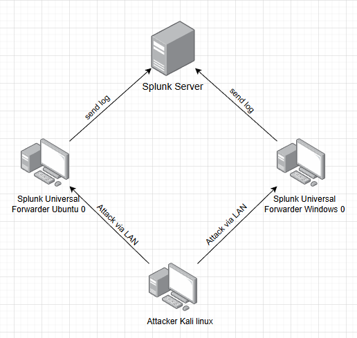
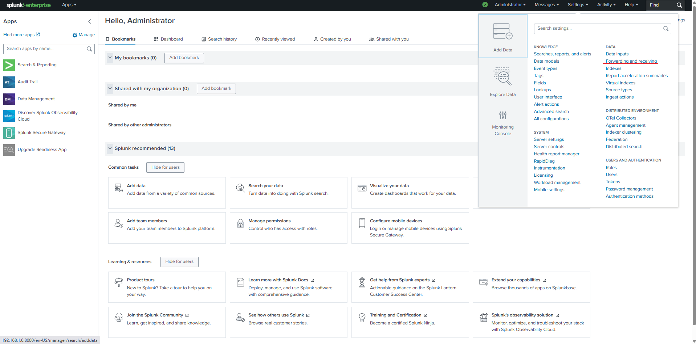
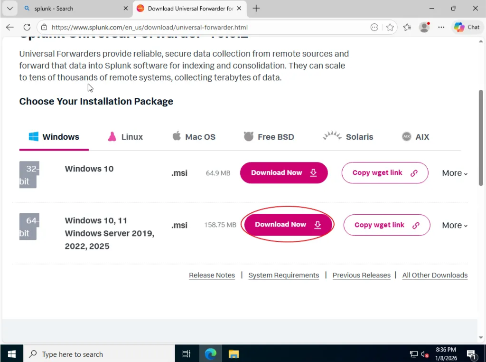

# #Lab 3: Splunk 10.0.2

# I. Thông tin LAB

**Mục tiêu chính:** Cài đặt Splunk Enterprise, Universal Forwarder, phân tích và tìm kiếm log bằng SPL, thiết lập một Dashboard đơn giản và tạo một Alert.

**Công cụ sử dụng:** Splunk Enterprise, Splunk Universal Forwarder (Ubuntu & Windows), Kali Linux, Oracle VirtualBox, PuTTY, Remote Desktop Connection.

**Thực hiện bởi:** Nguyễn Tiến Thanh Hải 

# II. Sơ đồ tổng quát



### 1. Chi tiết Host.

- Splunk Server:
    - **Vai trò:** Nơi nhận log của các Agent
    - **HĐH:** Ubuntu Server 24.04.3
    - **IP:** `192.168.1.6`
    - **Ghi chú:** Thiết lập IP tĩnh cho server
- Splunk Universal Forwarder Ubuntu 0:
    - **Vai trò:** Agent và Target Endpoint 1
    - **HĐH:** Ubuntu Desktop 24.04.2
    - **IP:** `192.168.1.10`
    - **Ghi chú:** Cài và start **OpenSSH Server** để kiểm tra Brute Force SSH.
- Splunk Universal Forwarder Windows 0:
    - **Vai trò:** Agent và Target Endpoint 2
    - **HĐH:** Windows Server 2022
    - IP: `192.168.1.11`
    - **Ghi chú:** Bật **RDP** để kiểm tra Brute Force RDP.
- Attacker Kali linux:
    - **Vai trò:** Attacker
    - **HĐH:** Kali linux
    - IP: `192.168.1.7`
    - **Ghi chú:** Phải đảm bảo rằng máy attacker có thể ping được đến 2 máy target.

### 2. Cấu hình Mạng

- Tất cả các máy trong sơ đồ đều cài mode Bridged Adapter hoặc NAT miễn là trong cùng 1 mạng LAN và có thể ping được đến nhau.


# III. Cấu hình Splunk Server

### 1. Cấu hình IP tĩnh cho server

- **Bước 1:** Truy cập path

```jsx
sudo nano /etc/netplan/50-cloud-init.yaml
```

- **Bước 2:** Cấu hình như sau


Sau khi cấu hình xong thì apply cấu hình bằng lệnh:

```jsx
sudo netplan apply
```

### 2. Cài đặt Splunk Enterprise

- **Bước 1**: Truy cập trang web chính thức của Splunk tạo tài khoản và đăng nhập

```jsx
[https://www.splunk.com/en_us/download/splunk-enterprise.html](https://www.splunk.com/en_us/download/splunk-enterprise.html)
```

- **Bước 2:** Chọn phiên bản Splunk Enterprise phù hợp với hệ điều hành


Ở đây mình sẽ tải phiên bản dành cho hệ điều hành Linux phiên bản có đuôi file .deb.

```jsx
wget -O splunk-10.0.2-e2d18b4767e9-linux-amd64.deb "[https://download.splunk.com/products/splunk/releases/10.0.2/linux/splunk-10.0.2-e2d18b4767e9-linux-amd64.deb](https://download.splunk.com/products/splunk/releases/10.0.2/linux/splunk-10.0.2-e2d18b4767e9-linux-amd64.deb)"
```

Copy đoạn script wget vào ubuntu server và chạy dưới quyền root.

**Lưu ý:** Đoạn script này sẽ thay đổi tùy vào từng phiên bản nên đoạn script trên chỉ mang tính tượng trưng!!


- **Bước 3:** Bắt đầu cài đặt Splunk

Sau khi đã tải gói Splunk về thành công như hình trên tiếp theo sẽ đến bước cài đặt, chạy đoạn script bên dưới để tiến hành cài đặt

```jsx
dpkg -i splunk-10.0.2-e2d18b4767e9-linux-amd64.deb
```

**Lưu ý:** Đoạn script sẽ thay đổi tùy vào từng phiên bản Splunk hãy copy tên gói .deb cho chuẩn xác!!


Sau khi việc cài đặt Splunk complete, copy đoạn script bên dưới để đọc điều khoản và tạo tài khoản admin cho web GUI

```jsx
/opt/splunk/bin/splunk enable
```


Đọc hết điều khoản và tạo tài khoản mật khẩu cho web GUI

Nhập đoạn script bên dưới này để enable Splunk

```jsx
/opt/splunk/bin/splunk enable boot-start
```


Nhập lần lượt lệnh:

```jsx
systemctl start splunk
systemctl status splunk
```


Status của Splunk hiển thị như vậy là đã cài đặt vào chạy thành công

- **Bước 4:** Sử dụng user name và password vừa tạo ở trên để truy cập web GUI của Splunk

Truy cập web GUI bằng địa chỉ IP của server với port 8000

```jsx
http://Your IP Address:8000
```

Giao diện đăng nhập của Splunk


Giao diện chính của Splunk


# IV Cài đặt Splunk Universal Forwarder

### 1. Cấu hình để server sẵn sàng nhận log

- **Bước 1:** Vào setting chọn phần Fowarding and receiving



- **Bước 2:** Add new 1 port mới để nhận log


- **Bước 3:** Chỉ định port và Save


- **Bước 4:** Tạo thêm 1 indexes cho windows log


Ấn vào New Index


Đặt tên và Save


### 2. Cài Splunk Universal Forwarder trên Ubuntu

- **Bước 1:** Truy cập web chính thức của Splunk và tải Splunk Universal Forwarder bằng script wget


```jsx
wget -O splunkforwarder-10.0.2-e2d18b4767e9-linux-amd64.deb "[https://download.splunk.com/products/universalforwarder/releases/10.0.2/linux/splunkforwarder-10.0.2-e2d18b4767e9-linux-amd64.deb](https://download.splunk.com/products/universalforwarder/releases/10.0.2/linux/splunkforwarder-10.0.2-e2d18b4767e9-linux-amd64.deb)"
```


- **Bước 2:** Bắt đầu cài đặt Splunk Universal Forwarder

```jsx
dpkg -i splunkforwarder-10.0.2-e2d18b4767e9-linux-amd64.deb
```


Truy cập path dưới để đọc điều khoản và tạo tài khoản

```jsx
cd /opt/splunkforwarder/bin/splunk start
```


- **Bước 3:** Add forward server bằng script

```jsx
/opt/splunkforwarder/bin/splunk add forward-server "your sever ip address":9997
```


restart splunkforwarder

```jsx
/opt/splunkforwarder/bin/splunk restart
```


- **Bước 4:** Thêm 1 số log cơ bản vào để giám sát trên server

```jsx
#Giam sat log xac thuc
sudo /opt/splunkforwarder/bin/splunk add monitor /var/log/auth.log
#Giam sat log he thong
sudo /opt/splunkforwarder/bin/splunk add monitor /var/log/syslog
```


- **Bước 5:** Kiểm tra log trên web GUI


Có thể thấy log đã đẩy về server thành công

### 3. Cài Splunk Universal Forwarder trên Windows

- **Bước 1:** Truy cập web chính thức của Splunk và tải file setup của Splunk Universal Forwarder



- **Bước 2:** Sử dụng file setup vừa tải để cài đặt Splunk Forwarder


Skip qua phần này


Ở đoạn này nhập IP và port của Server


Và Install


- **Bước 3:** Truy cập path bên dưới và chỉnh sửa file inputs.conf

```jsx
C:\Program Files\SplunkUniversalForwarder\etc\apps\SplunkUniversalForwarder\local\inputs.conf

```

Thêm index = win_log vào mỗi cụm Event


- **Bước 4:** Kiểm tra log trên web GUI


Có thể thấy log đã đẩy về server thành công

# V. Cấu hình các giao thức remote RDP và SSH

### **1. Cấu hình RDP trên windows**

- Chuột phải vào THIS PC vào Properties
- Chọn Advanced system settings
- Chọn mục Remote và chọn Allow
- Kiểm tra kết nối RDP vào máy  WindowSplunkAgent-0 (Bằng Remote Desktop Connection)

### 2. Cấu hình SSH trên ubuntu

- Cài đặt:

```jsx
sudo apt isntall openssh-server
sudo systemctl start ssh
sudo systemctl enable ssh
```

- Kiểm tra:


# VI. Mô phỏng tấn công

### 1. Tấn công BruteForce vào SSH trên Splunk Universal Forwarder Ubuntu 0

- Lệnh hydra trên máy kali để thực hiện tấn công

```jsx
hydra -l "username" -P /usr/share/wordlists/rockyou.txt "your IP address" ssh -V
```


Thực hiện tấn công để máy Splunk Universal Forwarder Ubuntu 0 bắt đầu gửi log về server

### 2. Tấn công BruteForce vào RDP trên Splunk Universal Forwarder Windows 0

- Lệnh hydra trên máy kali để thực hiện tấn công

```jsx
hydra -l admin -P /usr/share/wordlists/rockyou.txt -u -s 3389 "your IP address" rdp
```


Thực hiện tấn công để máy Splunk Universal Forwarder Windows 0 bắt đầu gửi log về server

# VII. Query SPL quan sát tấn công và tạo DashBoard

### 1. Query SPL quan sát Brute Force SSH

- **Bước 1:** Vào phần Search & Reporting


- **Bước 2:** Nhập Query bên dưới

```jsx
index=main sourcetype=auth ("authentication failure" OR "Failed password")
| stats count as Attempt_Count, values(user) as Targeted_Users by rhost, host
| where Attempt_Count > 5
| rename host as "Destination_Host", rhost as "Attacker_IP", Attempt_Count as "Total_Failed_Attempts"
| sort - Total_Failed_Attempts
```

**Giải thích cấu trúc của Query:**

1. **`index=main sourcetype=auth`**: Chỉ định tìm kiếm trong index `main` với các bản ghi xác thực hệ thống như `/var/log/auth.log` đã cấu hình giám sát trên Ubuntu Agent.
2. **`("authentication failure" OR "Failed password")`**: Lọc ra các sự kiện đăng nhập thất bại do sai mật khẩu hoặc user không tồn tại.
3. **`stats count as Attempt_Count, values(user) as Targeted_Users by rhost, host`**:
    - Đếm số lần thử sai (`Attempt_Count`).
    - Liệt kê các tài khoản bị nhắm tới (`Targeted_Users`).
    - Phân loại riêng biệt cho từng cặp Kẻ tấn công (`rhost`) và Máy đích (`host`).
4. **`where Attempt_Count > 5`**: Thiết lập ngưỡng cảnh báo. Chỉ hiển thị các IP có hành vi dò mật khẩu liên tục trên 5 lần để loại bỏ các trường hợp người dùng gõ nhầm thông thường.
5. **`rename ...`**: Chuyển đổi tên các trường trong Query.
6. **`sort - Total_Failed_Attempts`**: Sắp xếp máy Attacker có lần thử nhiều nhất lên đầu danh sách.
- **Bước 3:** Kết quả


### 2. Query SPL quan sát Brute Force RDP

- **Bước 1:** Vào phần Search & Reporting


- **Bước 2:** Nhập Query bên dưới

```jsx
index=win_log sourcetype="WinEventLog:Security" EventCode=4625
| stats count as Attempt_Count, values(Account_Name) as Targeted_Users, values(Workstation_Name) as Attacker_Machine_Name by Source_Network_Address, ComputerName
| where Attempt_Count > 5
| rename Source_Network_Address as "Attacker_IP", ComputerName as "Destination_Host", Attempt_Count as "Total_Failed_Attempts"
| sort - Total_Failed_Attempts
```

**Giải thích cấu trúc của Query:**

1. `index=win_log sourcetype="WinEventLog:Security"` : Chỉ định tìm kiếm trong index `win_log` với các bản ghi nhật ký bảo mật của Windows (Security Log).
2. `EventCode=4625` : Lọc ra các sự kiện đăng nhập thất bại (An account failed to log on) trên hệ thống Windows.
3. `stats count as Attempt_Count, values(Account_Name) as Targeted_Users by Source_Network_Address, ComputerName` :
    - Đếm số lần thử sai (`Attempt_Count`).
    - Liệt kê các tài khoản bị nhắm tới (`Targeted_Users`).
    - Phân loại riêng biệt cho từng cặp IP kẻ tấn công (`Source_Network_Address`) và Máy đích (`ComputerName`).
4. `where Attempt_Count > 5` : Thiết lập ngưỡng cảnh báo. Chỉ hiển thị các IP có hành vi dò mật khẩu liên tục trên 5 lần để loại bỏ các trường hợp người dùng gõ nhầm thông thường.
5. `rename ...` : Chuyển đổi tên các trường trong Query sang tên thân thiện (Attacker_IP, Destination_Host, Total_Failed_Attempts).
6. `sort - Total_Failed_Attempts` : Sắp xếp máy Attacker có lần thử nhiều nhất lên đầu danh sách.
- **Bước 3:** Kết quả


### 3. Tạo DashBoard

- **Bước 1:** Vào phần Search & Reporting


- **Bước 2:** Chọn mục DashBoard


- **Bước 3:** Create New Dashboard


- **Bước 4:** Đặt tên cho Dashboard và chọn Dashboard type và ấn Create


- **Bước 5:** Add Panel


Chọn Statistics Table, nhập Content Title và Search String (Query SPL tương ứng)


Làm tương tự với Query SSH

- **Bước 6:** Save DashBoard và quan sát


Thoát ra giao diện chính của Splunk và chọn mục DashBoard


Chọn DashBoard vừa tạo để hiển thị


**→ Kết quả:** Từ đây người dùng có thể quan sát được những hoạt động BruteForce đáng ngờ để kịp thời ứng cứu

# VIII. Tạo Alert

- **Bước 1:** Vào phần Search & Reporting


- **Bước 2:** Viết một query muốn chỉ định làm query cho alert và Save As Alert


- **Bước 3:** Đặt Title, Description và cấu hình phụ thuộc vào nhu cầu và Save cấu hình alert


→ Action này có nghĩa là Alert sẽ xuất hiện ở phần Activity → Triggered Alerts khi mà alert đc kích hoạt

- **Bước 4: Sử dụng 1 máy kali brute force ssh vào Forwarder Ubuntu và quan sát alert**


Phần App chọn All apps


→ Có thể thấy Alert đã hoạt động

# IX. Kết thúc lab

### 1. Lưu Ý Về Phạm Vi và Tuân Thủ Pháp Luật

- Toàn bộ các hoạt động, kịch bản tấn công, và thử nghiệm bảo mật được mô tả trong báo cáo này **chỉ được thực hiện trong môi trường phòng thí nghiệm ảo (Virtual Lab Environment)**, được kiểm soát chặt chẽ.
- **NGHIÊM CẤM** mọi hành vi tái tạo, thực thi các kịch bản tấn công này, hoặc bất kỳ hình thức xâm nhập trái phép nào khác, trong môi trường thực tế hoặc mạng lưới không được cấp quyền.
- **Hành vi tấn công, xâm nhập, hoặc dò quét trái phép vào hệ thống thực tế là hành vi vi phạm pháp luật và có thể bị truy cứu trách nhiệm hình sự theo quy định hiện hành.** Mục đích duy nhất của lab này là nhằm phục vụ cho mục đích học tập, nghiên cứu và nâng cao kỹ năng phòng thủ (Blue Team).