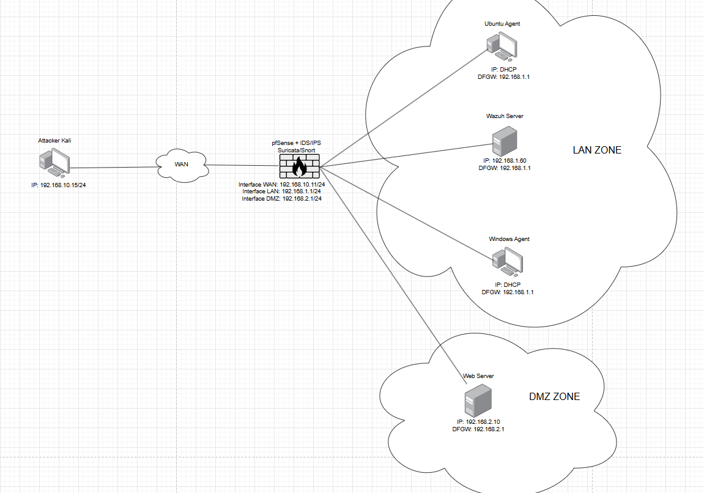
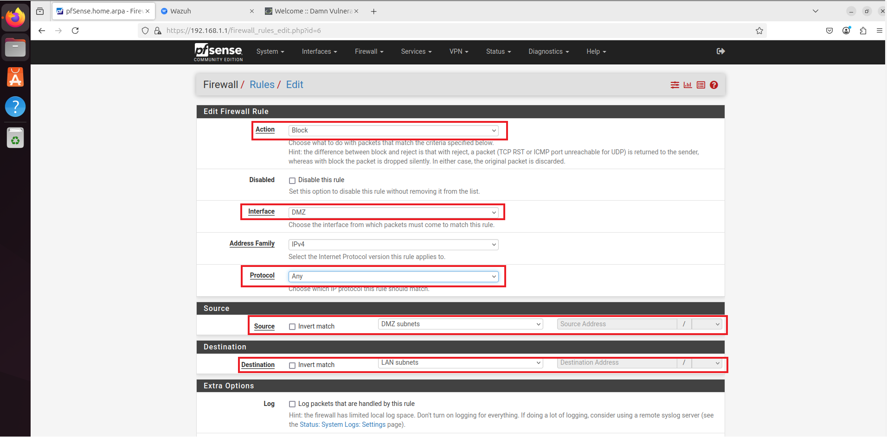
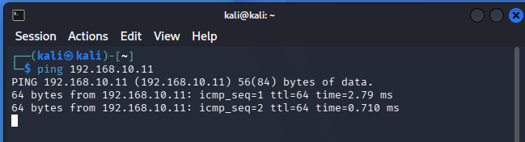
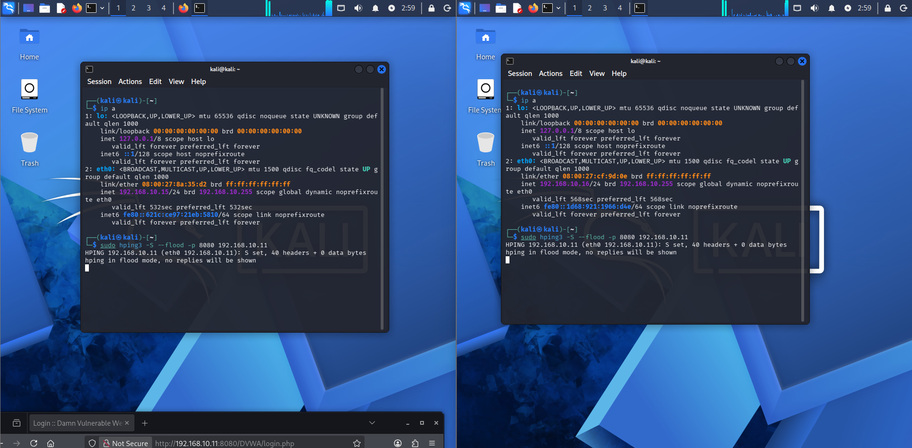
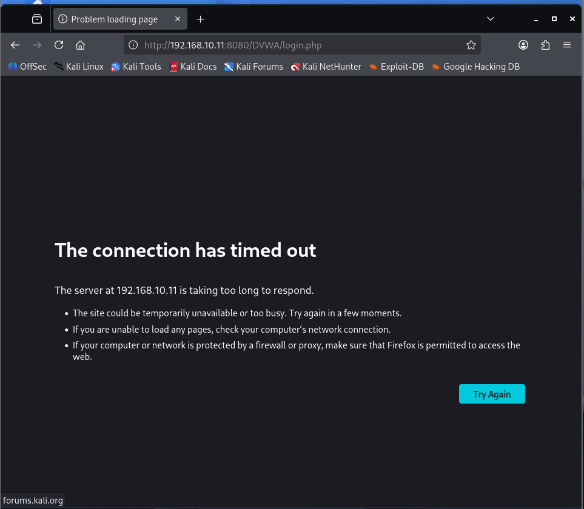
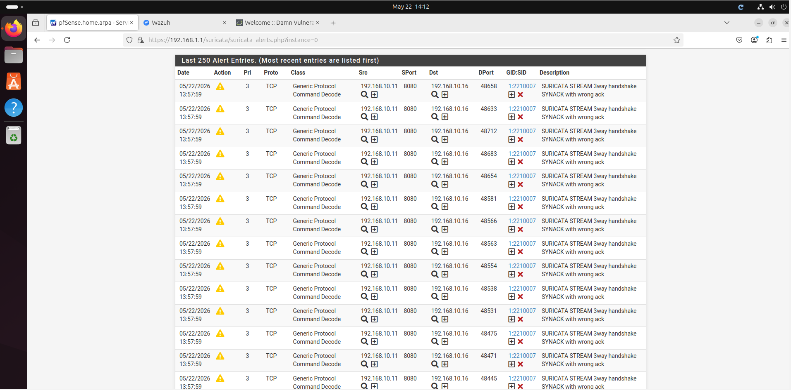
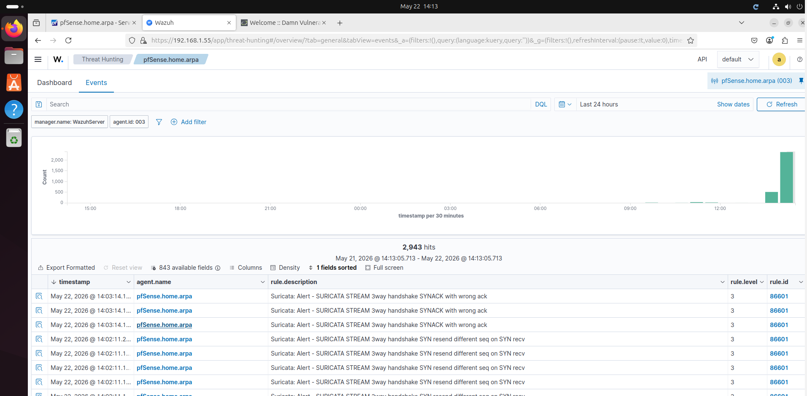
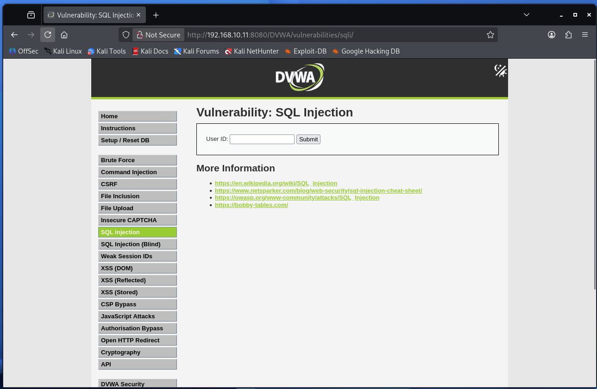

# #Lab 4: pfSense Firewall, Suricata IDS/IPS & Wazuh SIEM

# I. Thông tin LAB

**Mục tiêu chính:** Triển khai hệ thống tường lửa pfSense để phân vùng mạng (WAN, LAN, DMZ) và triển khai DVWA web bằng Web Server Apache trong vùng DMZ. Hệ thống tập trung thu thập toàn bộ dữ liệu log từ Endpoint, Firewall và Web Server về Wazuh, đồng thời thực nghiệm IDS/IPS thông qua các kịch bản tấn công mô phỏng để đánh giá khả năng giám sát và cảnh báo.

**Công cụ sử dụng:** Wazuh Server, Wazuh Agent (Ubuntu & Windows), Kali Linux, Oracle VirtualBox, PuTTY, Remote Desktop Connection.

**Thực hiện bởi:** Nguyễn Tiến Thanh Hải, Hồ Tuấn Phát

# II. Sơ đồ tổng quát

### 1. Network topology



### 2. Log traffic topology


### 3. Chi tiết Host.

- Wazuh server:
    - **Vai trò:** Manager / Indexer / Dashboard
    - **HĐH:** Ubuntu Server 24.04.3
    - **IP:** `192.168.1.55`
- Wazuh Agent Ubuntu:
    - **Vai trò:** Agent và Target Endpoint 1
    - **HĐH:** Ubuntu Desktop 24.04.2
    - **IP:** `192.168.1.x`
- Wazuh Agent Windows:
    - **Vai trò:** Agent và Target Endpoint 2
    - **HĐH:** Windows Server 2022
    - IP: `192.168.1.x`
- Firewall pfSense
    - **Vai trò:** Làm firewall và quản lý 3 vùng mạng
    - **HĐH:** Free BSD
    - **WAN IP:** 192.168.10.11
    - **LAN IP:** 192.168.1.1
    - **DMZ IP:** 192.168.2.1
- Web Server
    - **Vai trò:** Làm web server để host web DVWA cho kiểm thử IDS/IPS
    - **HĐH:** Ubuntu Server 24.04.3
    - **IP:** 192.168.2.15
    - **Ghi chú:** Cài đặt wazuh agent để thực hiện giám sát apache log
- Attacker Kali (WAN):
    - **Vai trò:** Attacker
    - **HĐH:** Kali linux
    - **IP:** `192.168.10.x`

# III. Cấu hình pfSense

### 1. Cấu hình các card mạng trên pfsense

- Ở lab này pfSense sẽ làm DHCP và Gateway cho các máy ở trong LAN dưới đây là các interface của pfSense


- **Adapter 1 (WAN):** Chế độ NAT Network hoặc Bridged để nhận internet và tiếp nhận lưu lượng từ máy Attacker bên ngoài

**Lưu ý:** Để sử dụng được chế độ NAT Network thì cần phải tạo 1 dải IP trong phần Network Manager


- **Adapter 2 (LAN):** Chế độ Internal Network cấp gateway cho Wazuh Server và các Endpoint Windows/Ubuntu


- **Adapter 3 (DMZ):** Chế độ Internal Network dành riêng cho Web Server để cách ly với vùng LAN

### 2. Cài đặt và cấu hình pfSense

- **Bước 1:** Cấu hình cơ bản và cài đặt gói Suricata

**Thiết lập DNS:**

Truy cập **Services > DNS Resolver**: Bỏ chọn *Enable DNS resolver*

Truy cập **Services > DNS Forwarder**: Chọn *Enable DNS forwarder*


**Mục đích:** Chuyển tiếp các truy vấn DNS ra máy chủ của google ở bên ngoài

- **Bước 2:** Đăng kí IP cho DMZ interface

Chọn interfaces → DMZ


Vào phần GUI cấu hình thực hiện đổi tên interface, đặt IP sau đó ấn Save để lưu lại cấu hình của interface


### 3. Thông số của các Interface trên pfSense


# IV. Triển khai Web Server và host DVWA Web trong vùng DMZ

### 1. **Cấu hình IP tĩnh cho Web Server**

Sử dụng trình soạn thảo `nano` để chỉnh sửa file cấu hình mạng:

```jsx
sudo nano /etc/netplan/50-cloud-init.yaml
```


Lưu file và thực thi lệnh sau để áp dụng cấu hình mới:

```jsx
sudo netplan apply
```

### 2. Cài đặt Web Server và triển khai ứng dụng DVWA

- **Bước 1:** Cài đặt Apache, MariaDB và PHP

Tiến hành cập nhật danh sách gói phần mềm và cài đặt các thành phần cần thiết cho Web Server

```jsx
sudo apt update && apt upgrade -y
sudo apt install apache2 mariadb-server php php-mysqli php-gd libapache2-mod-php git -y
```


- **Bước 2:** Tải và cấu hình  DVWA web

Tải mã nguồn từ GitHub về thư mục html của apache và thực hiện phân quyền

```jsx
cd /var/www/html
sudo git clone https://github.com/digininja/DVWA.git
sudo chown -R www-data:www-data /var/www/html/DVWA
sudo chmod -R 755 /var/www/html/DVWA
```


Kiểm tra dịch vụ CSDL

```jsx
sudo mysql -u root
```


- **Bước 3:** Khởi tạo Cơ sở dữ liệu MariaDB

Thực hiện các câu lệnh query để tạo database, user và gán quyền cho user

```jsx
CREATE DATABASE dvwa;
CREATE USER 'dvwa_user'@'localhost' IDENTIFIED BY 'password123';
GRANT ALL PRIVILEGES ON dvwa.* TO 'dvwa_user'@'localhost';
FLUSH PRIVILEGES;
EXIT;
```


- **Bước 4:** Thực hiện backup file cấu hình gốc và thực hiện thay đổi một số cấu hình của DVWA web

```jsx
cd /var/www/html/DVWA/config
sudo cp config.inc.php.dist config.inc.php
sudo nano config.inc.php
```


Sửa user name và password của file config sao cho khớp với user name và password vừa tạo trong MariaDB ở bên trên


- **Bước 5:** Chỉnh sửa tệp cấu hình PHP

```jsx
sudo nano /etc/php/8.x/apache2/php.ini  # Thay 8.x bằng phiên bản PHP bạn đã cài
```

**Lưu ý:** Phiên bản PHP có thể thay đổi hãy thực hiện cd dần dần để tìm

Các thông số cần thay đổi:

allow_url_fopen = On

allow_url_include = On

session.cookie_domain =

session.cookie_samesite = Lax


Vào thử web


Tại giao diện cài đặt DVWA, nhấn nút **Create / Reset Database** để hệ thống tự động khởi tạo bảng, dữ liệu mẫu và hoàn tất với thông báo **"Setup successful!"**


Truy cập thành công vào giao diện chính


### 3. Giới hạn Port trên DMZ

- **Bước 1:** Thiết lập một số Rule cần thiết

Đặt rule Firewall không cho phép DMZ truy cập LAN, và DMZ chỉ được mở port 1515/1514 để cho phép đăng kí Agent và gửi log đến Wazuh Server

Truy cập **Firewall > Rules > DMZ**


- **Rule 1:** Allow Port 1514/1515 đến Wazuh Server (192.168.1.55)


**Giải thích Rule:** Wazuh dùng port 1514 để tương tác giữa Server - Agent và port 1515 dùng để đăng kí Agent

- **Rule 2:** Block mọi traffic từ DMZ đến LAN zone


Ấn Add để thêm 1 rule vào cuối danh sách



**Giải thích Rule:** Chặn mọi truy cập từ DMZ vào LAN vì các Server trong vùng DMZ đều là những Server phục vụ những dịch vụ công cộng nên có nguy cơ bị tấn công việc thiết lập rule này nhằm cách ly ngăn chặn lateral movement từ DMZ sang LAN.

- **Bước 2:** Kiểm thử tác dụng của các rule vừa thiết lập

Rule 1 sẽ được kiểm thử ở bên dưới bằng cách đăng kí thành công Agent vào Web Server và thành công gửi log đến Wazuh Server


Thực hiện ping thử đến 1 máy trong LAN → Kết quả không thành công (Rule 2)

# V. Cài đặt và cấu hình Wazuh server

### 1. Cài đặt Wazuh Server

- **Bước 1:** Set IP tĩnh cho server

Truy cập path:

```jsx
sudo nano /etc/netplan/50-cloud-init.yaml
```

Cấu hình như sau:


Sau khi cấu hình xong thì apply cấu hình bằng lệnh:

```jsx
sudo netplan apply
```

- **Bước 2:** Cài đặt Wazuh server thông qua script quickstart

```jsx
curl -sO https://packages.wazuh.com/4.14/wazuh-install.sh && sudo bash ./wazuh-install.sh -a
```

**Lưu ý:** Script có thể thay đổi tùy vào từng phiên bản hãy sử dụng script quickstart ở web chính thức của Wazuh


- **Bước 3:** Sử dụng “User” và “Password” vừa được cấp đăng nhập vào dashboard

Truy cập dashboard bằng:

```jsx
https://"your ip address"
```

Giao diện đăng nhập của wazuh dashboard:


Giao diện wazuh dashboard:


### 2. Đổi mật khẩu cho account admin

- **Bước 1:** Truy cập path

```jsx
 cd /usr/share/wazuh-indexer/plugins/opensearch-security/tools/
```

- **Bước 2:** Dùng script để thay password

```jsx
/usr/share/wazuh-indexer/plugins/opensearch-security/tools# ./wazuh-passwords-tool.sh -u admin -p "your new pass word"
```

→ Mật khẩu mới ở đây sẽ là “your new pass word” truy cập lại dashboard với mật khẩu mới

# VI. Triển khai các Wazuh Agent trên các Endpoint

### 1. Cài đặt Wazuh Agent trên Linux (Vùng LAN)

- **Bước 1:** Tải và cài đặt gói Wazuh Agent

Sử dụng dòng lệnh để tải trực tiếp gói cài đặt `.deb` từ kho lưu trữ của Wazuh và cài đặt kèm theo các biến môi trường cấu hình

Lệnh thực hiện:

```jsx
wget https://packages.wazuh.com/4.x/apt/pool/main/w/wazuh-agent/wazuh-agent_4.14.1-1_amd64.deb && sudo WAZUH_MANAGER='192.168.1.6' WAZUH_AGENT_NAME='Wazuh-Agent-Ubuntu-0' dpkg -i ./wazuh-agent_4.14.1-1_amd64.deb
```

**Giải thích:**

`wget`: Tải tệp cài đặt `wazuh-agent_4.14.1-1_amd64.deb`.

`WAZUH_MANAGER`: Chỉ định địa chỉ IP của Wazuh Manager để Agent kết nối tới.

`WAZUH_AGENT_NAME`: Đặt tên định danh cho máy Ubuntu trên hệ thống.

`dpkg -i`: Lệnh thực hiện cài đặt gói phần mềm đã tải về.

- **Bước 2:** Kích hoạt và khởi chạy dịch vụ

Sau khi cài đặt xong, cần làm mới cấu hình hệ thống và thiết lập cho dịch vụ tự động chạy cùng hệ điều hành.

```jsx
sudo systemctl daemon-reload
sudo systemctl enable wazuh-agent
sudo systemctl start wazuh-agent
```


- **Bước 3:** Kiểm tra trên Wazuh Dashboard

Kiểm tra agent `UbuntuAgent` đã xuất hiện và trạng thái **Active**


### 2. Cài đặt Wazuh Agent trên Windows (Vùng LAN)

- **Bước 1:** Tải Wazuh Agent

Mở PowerShell (Run as Administrator) và chạy lệnh:

```jsx
Invoke-WebRequest -Uri https://packages.wazuh.com/4.x/windows/wazuh-agent-4.14.3-1.msi -OutFile $env:tmp\wazuh-agent; msiexec.exe /i $env:tmp\wazuh-agent /q WAZUH_MANAGER='192.168.1.50' WAZUH_AGENT_NAME='WindowsAgent'
```

**Giải thích:**

`WAZUH_MANAGER`: Khai báo địa chỉ IP của Wazuh Server để Agent kết nối về.

`WAZUH_AGENT_NAME`: Đặt tên định danh cho máy trạm này trên hệ thống quản lý.

- **Bước 2:** Khởi chạy dịch vụ Wazuh

Sau khi cài đặt xong, cần khởi động dịch vụ để Agent bắt đầu gửi dữ liệu về Server. Tiếp tục thực hiện lệnh trên Powershell:

```jsx
NET start wazuh
```

Kết quả mong đợi:

The Wazuh service is starting.

The Wazuh service was started successfully.


- **Bước 3:** Kiểm tra trên Wazuh Dashboard

Kiểm tra agent `WindowsAgent` đã xuất hiện và trạng thái **Active**


### 3. Cài đặt Wazuh Agent trực tiếp trên pfSense

- **Bước 1:** Chuẩn bị môi trường cài đặt

**Cài đặt trình soạn thảo Nano:**

```jsx
pkg install nano
```


**Mở khóa Repository:** Sử dụng Nano chỉnh sửa file cấu hình repo

```jsx
nano /usr/local/etc/pkg/repos/pfSense.conf
```

Tìm dòng `FreeBSD: { enabled: no }` và sửa thành `yes`


- **Bước 2:** Tải và cài đặt Wazuh Agent

Sau khi cập nhật kho ứng dụng, tiến hành tìm kiếm và cài đặt phiên bản phù hợp

```jsx
pkg update
pkg search wazuh-agent
pkg install wazuh-agent-4.14.3
```


- **Bước 3:** Cấu hình kết nối và Kích hoạt dịch vụ

Chỉnh sửa cấu hình kết nối:

```jsx
nano /var/ossec/etc/ossec.conf
```

Tại phần <client>, trong thẻ <server>, cần thực hiện hai thay đổi để đảm bảo kết nối:

1. **<address>**: Chỉnh sửa địa chỉ IP mặc định thành địa chỉ IP của Wazuh Manager   
2.  **<protocol>**: Thay đổi giao thức từ UDP (mặc định) sang tcp   


- **Bước 4:** Kích hoạt dịch vụ

Thiết lập dịch vụ tự động khởi chạy và cấu hình để Wazuh thu thập dữ liệu từ Suricata.  

**Cho phép dịch vụ hoạt động:**

```jsx
sysrc wazuh_agent_enable="YES"
```

Tạo liên kết khởi động tự động:

```jsx
ln -s /usr/local/etc/rc.d/wazuh-agent /usr/local/etc/rc.d/wazuh-agent.sh
```

Khởi động dịch vụ:

```jsx
service wazuh-agent start
```

Kết quả thực hiện:

Hệ thống phản hồi thông báo khởi chạy kèm dòng chữ **"success":**


- **Bước 5:** Cấu hình Suricata để gửi log về Wazuh:

Truy cập vào menu Services > Suricata > Logs View. Tại mục chọn file log (Log File to View), chọn định dạng eve.json. Giao diện sẽ hiển thị đường dẫn tuyệt đối của file log này trên hệ thống


Sử dụng lệnh `nano /var/ossec/etc/ossec.conf` để mở tệp cấu hình trung tâm của Agent trên pfSense và bổ sung khối cấu hình sau:

```jsx
<localfile>
    <log_format>json</log_format>
    <location>/var/log/suricata/suricata_em048242/eve.json</location>
</localfile>
```


**Giải thích:**

`<log_format>json</log_format>`: Định nghĩa định dạng dữ liệu là JSON. Đây là điều bắt buộc vì file `eve.json` của Suricata lưu trữ sự kiện theo cấu trúc này.

`<location>`: Đường dẫn trỏ đến tệp tin log đã xác định ở bước trước.

Khởi động lại dịch vụ:

```jsx
service wazuh-agent restart
```

Kết quả thực hiện

Thông báo `success` xác nhận Agent đã nạp cấu hình mới thành công


### 4. Cài đặt Wazuh Agent trên Web Server (Vùng DMZ)

- **Bước 1:** Truy cập giao diện Wazuh, vào mục **Agents Management**


Chọn vào Deploy new agent


Cấu hình thông tin cơ bản


- **Bước 2:** Sử dụng script được Wazuh cấp sẵn để tải gói `.deb` và thực hiện cài đặt tự động trên Web Server

```jsx
sudo wget https://packages.wazuh.com/4.x/apt/pool/main/w/wazuh-agent/wazuh-agent_4.14.4-1_amd64.deb && sudo WAZUH_MANAGER='192.168.1.55' WAZUH_AGENT_NAME='WebServerAgentDMZ' dpkg -i ./wazuh-agent_4.14.4-1_amd64.deb
```


Chạy các lệnh sau để kích hoạt dịch vụ và thiết lập tự động khởi động cùng hệ thống:

```jsx
sudo systemctl daemon-reload
sudo systemctl enable wazuh-agent
sudo systemctl start wazuh-agent
```


**Lưu ý:** Khi thực hiện cài đặt Wazuh Agent trên Web Server DMZ mình đã thực hiện mở rule cho phép SSH từ LAN vào DMZ  để thực hiện cài đặt cho tiện (copy scripts cho nhanh xDD) sau khi cài xong mình đã disable rule SSH.

### 5. Kiểm tra trạng thái kết nối của các Agent

Sau khi cài đặt xong, quay lại trang Wazuh để xác nhận các thiết bị đã kết nối thành công hay chưa


→ Agent trên Web Server DMZ vẫn đăng kí và hoạt động bình thường (Firewall Rule 1)

# VII. Cài đặt và cấu hình hệ thống IDS/IPS Suricata

- **Bước 1:** Cài đặt Suricata vào pfSense


Truy cập System → Package Manager


Ấn Install để cài đặt gói Suricata


→ Cài đặt thành công

- **Bước 2:** Thực hiện cấu hình cho Suricata tiến hành giám sát trên WAN Interface


Tại **Services > Suricata > Interfaces**, nhấn **Add** để chọn cổng cần giám sát 


Bắt đầu cấu hình Suricata


Cấu hình Suricata để xuất Alert ra 1 file eve.json sau đó ấn Save


Vào tab Global Settings để tải các bộ Rule về


Vào tab Updates để cập nhật các bộ rule mới


Trở lại tab Interfaces và chọn vào biểu tượng chỉnh sửa tương ứng với cổng WAN (em0) đã được thêm trước đó


Chọn **Select All**  để kích hoạt tối đa khả năng phát hiện xâm nhập cho mục đích thực nghiệm


- **Bước 3:** Kiểm thử cơ bản Suricata

Sử dụng máy Kali ping vào Interface WAN của pfSense



Kết quả cảnh báo của Suricata khi ping vào WAN Interfaces


Sử dụng máy Kali thử tấn công BruteForce SSH vào WAN Interface của pfSense


Kết quả cảnh báo của Suricata khi tấn công BruteForce SSH


**Lưu ý:** Hiện tại chỉ đang kiểm thử chức năng IDS của Suricata chức năng IPS sẽ được thực hiện kiểm thử ở phần sau.

# VIII. NAT Port cho SSH và Web Server

### 1. NAT Port SSH cho máy trong LAN ra bên ngoài WAN

- **Bước 1:** Vào Firewall → NAT


Ấn Add để thêm NAT rule mới


- **Bước 2:** Cấu hình NAT rule


Chỉnh redirect port về SSH sau đó Save


- **Bước 3:** Kiểm tra kết nối

Sử dụng máy Kali ngoài WAN SSH vào máy Ubuntu ở trong LAN


→ Thành công đăng nhập SSH vào LAN

### 2. NAT PORT 8080 cho Web Server trong DMZ ra bên ngoài WAN

- **Bước 1:** Vào Firewall → NAT


Ấn Add để thêm NAT rule mới


**Bước 2:** Cấu hình NAT rule


Chỉnh trỏ IP về IP của máy Web Server trong DMZ và chỉnh về port về dịch vụ HTTP sau đó Save


- **Bước 3:** Kiểm tra kết nối

Sử dụng máy Kali ngoài WAN truy cập vào DVWA web được đặt ở DMZ


→ Thành công truy cập vào website

# IX. Mô phỏng tấn công, quan sát Log và kiểm thử tính hiệu quả của Suricata IPS

### 1. Tấn công DDoS

#### 1.1 Tấn công DDoS khi không có IPS

- **Bước 1:** Chuẩn bị công cụ tấn công

Sử dụng script hping3 để thực hiện khai thác quá trình bắt tay 3 bước gửi các gói SYN nhưng không phản hồi lại (SYN flood)

```jsx
sudo hping3 -S --flood -p 8080 192.168.10.11
```

Sử dụng 2 máy Kali để thực hiện tấn công


- **Bước 2:** Bắt đầu cuộc tấn công



- **Bước 3:** Quan sát kết quả và log

Video khi thực hiện load lại web site trong khi đang thực hiện tấn công DDoS

[DDoS_attack_1.mp4](DDoS_attack_1.mp4)

Website không thể phản hồi lại Request hợp lệ



Quan sát log trong Suricata



Quan sát log mà Suricata gửi về Wazuh Server



#### 1.2 Tấn công DDoS khi có IPS

- **Bước 1:** Bật chức năng IPS trên Suricata

Services → Suricata


Edit 


Tích vào ô mở chức năng Block Offenders và Save


Blocking Mode: LEGACY MODE là thành công


- **Bước 2:** Thử nghiệm tấn công DDoS khi có IPS

Thực hiện tấn công


Video khi reload lại website user hợp lệ vẫn vào bình thường

[kkk.mp4](kkk.mp4)

Block list của Suricata


Chứa 2 IP của 2 máy tấn công và sau khi bị block 2 máy này sẽ không còn có thể truy cập bất cứ tài nguyên nào được nữa.


### 2. Tấn công BruteForce SSH

#### 2.1 Tấn công BruteForce SSH khi không có IPS

- **Bước 1:** Chuẩn bị scripts BruteForce SSH

```jsx
hydra -l "username" -P /usr/share/wordlists/rockyou.txt "your IP address" ssh -V
```

- **Bước 2:** Thực hiện tấn công

Khi không có IPS BruteForce SSH đã dò được mật khẩu của user


Wazuh log thông báo rằng có 1 lần thử thành công trong chuỗi tấn công BruteForce


Suricata Alert


→ Khi không có IPS tất cả chỉ dừng lại ở mức cảnh báo vì thế hacker vẫn có thể đánh cắp và xâm nhập vào tài khoản của user

#### 2.2 Tấn công BruteForce SSH khi có IPS

- **Bước 1:** Bật chức năng IPS trên Suricata

Services → Suricata


Edit 


Tích vào ô mở chức năng Block Offenders và Save


Blocking Mode: LEGACY MODE là thành công


- **Bước 2:** Thử nghiệm tấn công BruteForce SSH khi có IPS


Kết quả cuộc tấn công bị dừng giữa chừng và không thể tiếp tục dò mật khẩu


→ Đúng mật khẩu nhưng hydra không thể báo thành công do không có response từ target do đã bị IPS ch 

Suricata alert


Suricata block list


→ Ngăn chặn được việc user bị dò ra mật khẩu và đảm bảo sự an toàn cho hệ thống

### 3. Tấn công SQL Injection

#### 3.1 Tấn công SQL Injection khi không có IPS

- **Bước 1: Truy cập DVWA web vào phần SQL Injection**



- **Bước 2:** Tiêm Script SQL Injection vào ô User ID

Nhập Script: 

```jsx
1' UNION SELECT 1, table_name FROM information_schema.tables WHERE table_schema='dvwa' #
```

Kết quả sau khi tiêm scripts SQLi vào ô User ID


Suricata Alert


Wazuh log


#### 3.2 Tấn công SQL Injection khi có IPS

- **Bước 1:** Bật chức năng IPS trên Suricata

Services → Suricata


Edit 


Tích vào ô mở chức năng Block Offenders và Save


Blocking Mode: LEGACY MODE là thành công


- **Bước 2:** Thử nghiệm tấn công SQLi khi có IPS

Nhập Script: 

```jsx
1' UNION SELECT 1, table_name FROM information_schema.tables WHERE table_schema='dvwa' #
```

Video khi tiêm scripts vào web server

[hel (1).mp4](hel_(1).mp4)

Suricata Alert


Suricata Block list


# X. Kết thúc lab

### **1. Kết luận bài Lab**

Bài thực hành đã triển khai thành công mô hình phòng thủ chiều sâu (**Defense-in-Depth**) thông qua việc kết hợp pfSense (Phân vùng mạng WAN/LAN/DMZ), Suricata (Phát hiện xâm nhập sâu mức mạng - IDS/IPS) và Wazuh (Giám sát, quản lý log tập trung - SIEM). Quá trình kiểm thử bằng các kỹ thuật tấn công mô phỏng (SQL Injection, DDoS, Brute Force) đã minh chứng được khả năng giám sát chủ động, tương quan dữ liệu và phát hiện sự cố hiệu quả của mô hình SOC thu nhỏ, tạo tiền đề vững chắc cho việc nghiên cứu các mô hình tương tự như SOAR.

### **2. Tuyên bố miễn trừ trách nhiệm**

Toàn bộ nội dung, kịch bản tấn công và công cụ thử nghiệm (sqlmap, hping3, hydra) trong bài báo cáo này chỉ phục vụ cho mục đích học tập, nghiên cứu học thuật và kiểm thử năng lực phòng thủ của hệ thống. Tất cả các thao tác đều được thực hiện trong môi trường phòng thí nghiệm (Lab) ảo hóa, cô lập hoàn toàn. Tác giả không chịu trách nhiệm cho bất kỳ hành vi lạm dụng kiến thức này để can thiệp, phá hoại trái phép vào các hệ thống mạng thực tế mọi hành vi vi phạm sẽ phải tự chịu trách nhiệm trước Luật An ninh mạng hiện hành.